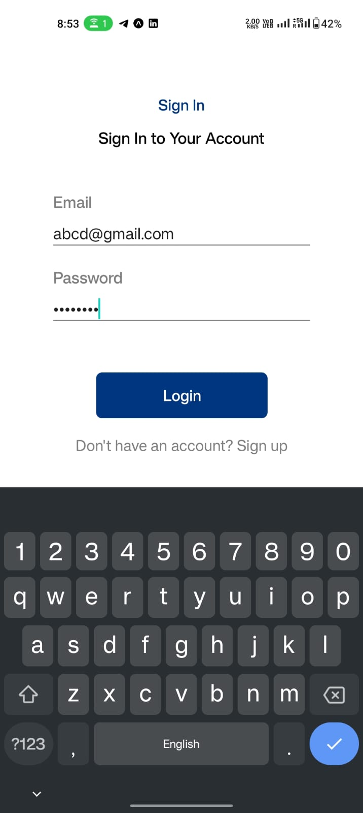

# Hotel Booking Android Application
This Android application allows users to browse hotels, log in with Google using Firebase authentication, search for hotels, view hotel details, read reviews, and book rooms. The app also includes a logout feature.

## Features
1. Firebase Google Login: Users can log in using their Google accounts through Firebase authentication.

2. Home Page: The home page displays a list of hotels in cards format with the following details:
  Hotel Name
  Slideshow of hotel images
  City
  Star Rating
  Average User Rating (displayed through design)
  "Book Now" Button

3. Search Functionality: Users can search for specific hotels by entering a keyword or hotel name in the search bar.

4. Hotel Details: Clicking on a hotel card expands it to show additional details, including:

Hotel Description
Location
Facilities
Room Types
Reviews and Ratings
Booking: Users can book a room by clicking the "Book Now" button on a hotel card. After booking, they receive an in-app notification with the message "Your booking has been confirmed."

5.Logout: Users can log out of their account by clicking the logout button.

### Screenshots
(Insert screenshots of your app here)


### Setup
To run this project locally, follow these steps:
  ```s
1. Clone the repository to your local machine:

  git clone https://github.com/your_username/hotel-booking-app.git

2.Configure Firebase:
Create a Firebase project on the Firebase Console.
Configure the project to use Google authentication.

3.Download the google-services.json file and place it in the app module directory of your project.

4. Install dependencies
npm install

5. Download EXPO GO app on your device  and scan the QR code genereated after the following command :
expo start

## Technologies Used
   React Native
   Expo Go
   Firebase Authentication
   Firebase Realtime Database or Firestore (for storing hotel data and user information)
